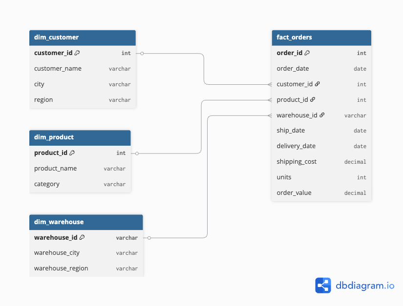
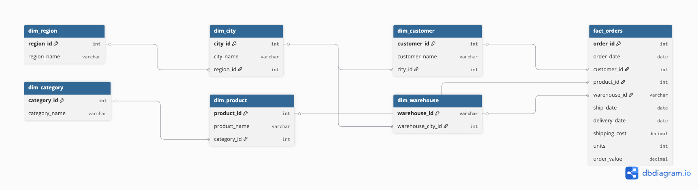

# ⭐ Star vs Snowflake Schema – Data Modeling Project

## 📌 Overview
This project demonstrates dimensional data modeling using Star Schema and Snowflake Schema for a warehouse analytics use case.

The goal is to transform raw, denormalized operational data into structured, analytics-ready models that support efficient business reporting and decision-making.

---

## 🎯 Business Problem
Organizations often store data in raw, denormalized formats, making it difficult to perform efficient analytics.

This project answers:
How can we structure warehouse and order data to enable fast, scalable, and meaningful analysis?

---

## 🧠 Objective
- Design a Star Schema for fast analytical querying
- Design a Snowflake Schema for normalized data modeling
- Compare both approaches based on performance, complexity, and usability
- Run business queries to extract insights

---

## 🏗️ Data Model Diagrams

Diagrams were created using dbdiagram.io for clear visualization of schema relationships.

### ⭐ Star Schema


### ❄️ Snowflake Schema


---

## 🧱 Data Modeling Approach

### ⭐ Star Schema
- Central fact table connected to denormalized dimension tables
- Optimized for fast querying and reporting

### ❄️ Snowflake Schema
- Normalized dimension tables
- Reduced redundancy and improved data integrity
- Requires more joins for querying

---

## 📊 Key Business Queries

Examples of analysis performed:

- Revenue by warehouse
- Product performance (units sold)
- Regional revenue trends
- Average shipping cost
- Delivery time analysis

---

## ⚖️ Star vs Snowflake Comparison

| Aspect | Star Schema | Snowflake Schema |
|--------|-------------|------------------|
| Structure | Denormalized | Normalized |
| Query Speed | Faster | Slightly slower |
| Complexity | Simple | Complex |
| Storage | Higher redundancy | Optimized |
| Use Case | BI dashboards | Enterprise data models |

---

## 💡 Key Takeaways
- Star schema simplifies querying and improves performance for analytics
- Snowflake schema improves data integrity and reduces redundancy
- The choice depends on business needs: speed vs structure

---

## 🛠️ Tech Stack
- SQL
- Data Modeling
- Dimensional Modeling
- dbdiagram.io
- Git & GitHub

---

## 📁 Project Structure

```text
star-vs-snowflake-schema/
│
├── data/
│   └── raw/
│       └── raw_orders.csv
│
├── sql/
│   ├── star_schema.sql
│   ├── snowflake_schema.sql
│   └── analysis_queries.sql
│
├── notebooks/
├── diagrams/
├── README.md
└── requirements.txt
```

